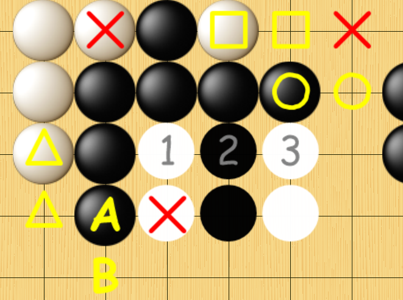
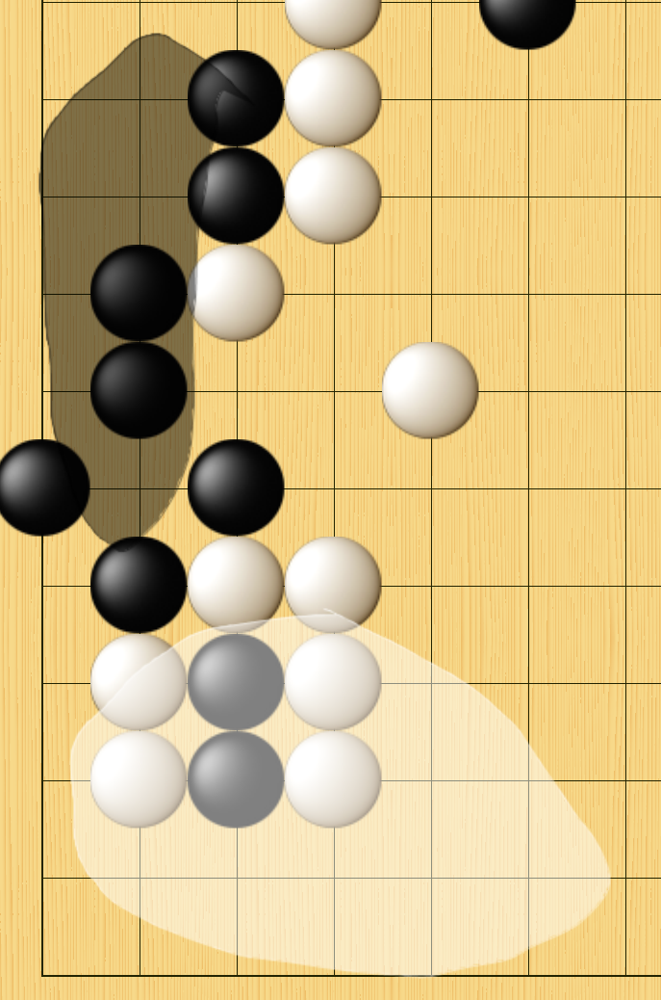
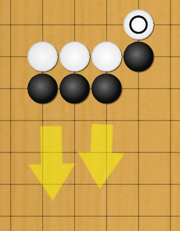
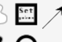
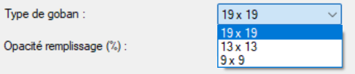
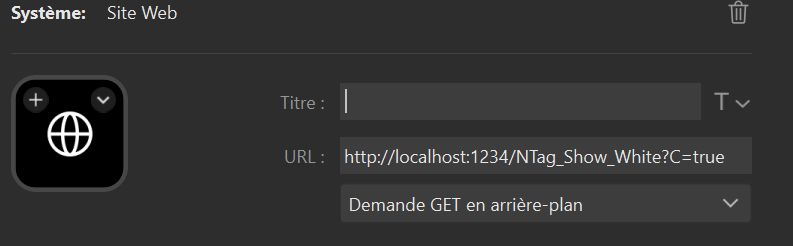

<table>
  <tr>
    <td valign="center">
       
    </td>
    <td valign="middle">
      
	  
Un outil graphique pour commenter des parties de jeu de go

    </td>
  </tr>
</table>

[English version](readm_EN.md)

#### *goInk* est un outil pour faciliter les commentaires de parties de jeu de go. goInk est un fork de [ppInk](https://github.com/pubpub-zz/ppInk), lui-même fork de [gInk](https://github.com/geovens/gInk). Grand merci à eux. 

## Sommaire
- [Avertissements](#avertissements)
- [Fonctionnalités](#fonctionnalités-pour-le-jeu-de-go)
- [Dimensions du goban](#important--définissez-les-dimensions-de-votre-goban-avant-dutiliser-les-outils)
- [Utilisation](#utilisation)
- [Problèmes connus](#problèmes-connus)
- [Lien avec OBS](#lien-avec-obs)
- [goInk et StreamDeck](#goink-et-streamdeck)
  - [Pour les outils spécifiques au jeu de go](#pour-les-outils-spécifiques-au-jeu-de-go)
  - [Tous les autres endpoints](#liste-des-autres-endpoints-rest-disponibles-résumé-fonctionnel-du-fichier-apirestcs)
  - [Prédéfinir vos gobans](#prédéfinir-vos-gobans)

## Avertissements
Ce fork a été exclusivement réalisé avec l'aide d'une IA, car je ne suis pas du tout développeur de code. 
A priori, il est globalement exempt de bug et fonctionne bien sur mon ordinateur, 
mais je ne peux pas garantir qu'il n'y aura aucun problème sur un autre ordinateur. 

Si vous avez une demande particulière, n'hésitez pas à me contacter (mon adresse email est dans mon profil GitHub).

Si vous constatez un problème, n'hésitez pas à le signaler dans la section "Issues" de la page GitHub.

Si vous souhaitez contribuer au développement de ce logiciel, vous êtes le bienvenu.

## Fonctionnalités pour le jeu de go
Ne sont décrits ici que les ajouts spécifiques au jeu de go, les autres fonctionnalités de ppInk sont documentées sur https://github.com/pubpub-zz/ppInk/

Pour les besoins spécifiques du jeu de go, nous avons créé les outils suivants : 
#### - ajout d'une séquence de pierres (aléternées noire/blanc), avec ou sans numéros. 
#### - ajout de zones (blanches ou noires) dessinées à main levées
#### - ajout de lettres (A, B, C, ...) et de symboles (triangle, carré, croix, cercle) sur le goban)
#### - ajout de flèches

Ces outils sont paramétrables (couleur, opacité, taille, ...) dans le menu option accessible avec un clic droit sur l'icône de la barre des tâches.

## Important : définissez les dimensions de votre goban avant d'utiliser les outils
Les outils sont <u>automatiquement redimensionnés</u> à la taille du goban qui est en cours d'utilisation, avec une <u>aimantation sur les intersections</u> du goban. 

L'utilisateur doit donc définir au préalable la dimension du goban, en utilisant l'outil "set goban" dans la barre d'outils : 

, puis dessiner un rectangle aux dimensions du goban (cliquer sur l'intersection en haut à gauche, maintenir le clic jusqu'à l'intersection en bas à droite, puis relâcher). 

Si le goban n'est pas un 19x19, penser à changer dans le menu options : 

## Utilisation
Les outils sont accessibles par raccourcis clavier, qui peuvent être appelés depuis un StreamDeck, ou bien par une API comme expliqué sur la page [Conseils pour StreamDeck](/src/doc/readme_StreamDeck.md)

Les raccourcis sont également paramétrables dans le menu options.

## Problèmes connus
Parfois, certains changements dans le menu Options nécessitent de cliquer sur "Sauver configuration" dans le premier onglet du menu Options, faute de quoi ils ne sont pas enregistrés. 

Parfois, les changements du menu Options ne sont pris en compte qu'après avoir rouvert/refermé la barre d'outils. 

Les outils Lettres, Carré, Cercle, Triangle et Croix n'ont pas de bouton dans la barre d'outils : ils ne peuvent être appelés que par raccourci clavier (je n'ai pas réussi à ajouter les boutons dans la barre d'outils)

Selon l'orientation de la barre d'outils, elle peut être tronquée. 

D'une manière générale, goInk est davantage conçu pour fonctionner avec des raccourcis clavier que via la barre d'outils. 

## Lien avec OBS
Théoriquement, ppInk peut exporter vers OBS Studio ([Documentation ppInk](https://pubpub-zz.github.io/ppInk/#video-recording)), 
mais cela ne fonctionne plus avec les versions récentes d'OBS. 

## goInk et StreamDeck
- [Pour les outils spécifiques au jeu de go](#pour-les-outils-spécifiques-au-jeu-de-go)
- [Tous les autres endpoints](#liste-des-autres-endpoints-rest-disponibles-résumé-fonctionnel-du-fichier-apirestcs)]
- [Prédéfinir vos gobans](#prédéfinir-vos-gobans)

Il est possible d'utiliser goInk avec des raccourcis clavier, mais également avec [Rest API](https://github.com/fakirsu/ppInk?tab=readme-ov-file#rest-api). Les deux solutions sont possibles avec un StreamDeck. A ma connaissance, il y a très peu de différences en termes de performances, consommation de ressource, fiabilité, ... 

Pour ma part j'utilise Rest API, car cela évite des conflits potentiels de raccourcis clavier avec d'autres applications.

Dans StreamlDeck, il suffit d'appeler une adresse du type 
http://localhost:*le_port_fourni_dans le menu_option*/**le_nom_de_l_action**. Exemple : 

## Pour les outils spécifiques au jeu de go

- /OpenToolbar
  Description : Ouvrir la barre d'outils (si pas déjà ouverte)  
  "http://localhost:1234/OpenToolbar"

  /CloseToolbar
  Description : Fermer la barre d'outils (si pas déjà fermée)
  "http://localhost:1234/CloseToolbar"

- /RectTool  
  Description : Outil "Set goban" pour définir les dimensions du goban  
  "http://localhost:1234/RectTool"

- /NTag_Show_White  
  Description : Pierres numérotées (première pierre blanche)  
  "http://localhost:1234/NTag_Show_White"  

- /NTag_Show_Black  
  Description : Pierres numérotées (première pierre noire)  
  "http://localhost:1234/NTag_Show_Black"

- /NTag_Hide_White  
  Description : Ajout de pierres sans numéros (1ère blanche)  
  "http://localhost:1234/NTag_Hide_White"

- /NTag_Hide_Black  
  Description : Ajout de pierres sans numéros (1ère noire)  
  "http://localhost:1234/NTag_Hide_Black"

- /HandFilledWhite  
  Description : Ajout d'une zone blanche  
  "http://localhost:1234/HandFilledWhite"

- /HandFilledBlack  
  Description : Ajout d'une zone noire  
  "http://localhost:1234/HandFilledBlack"

- /HandFilledBlack  
  Description : Ajout d'une flèche 
  "http://localhost:1234/AddArrow"

- /LetterTag  
  Description : Ajout de lettres (A, B, C, ...)  
  "http://localhost:1234/LetterTag"

- /SquareTag  
  Description : Ajout de carrés  
  "http://localhost:1234/SquareTag"

- /TriangleTag  
  Description : Ajout de triangles  
  "http://localhost:1234/TriangleTag"

- /CircleTag  
  Description : Ajouts de cercles  
  "http://localhost:1234/CircleTag"

- /CrossTag  
  Description : Ajout de croix  
  "http://localhost:1234/CrossTag"

- /Text_Color
  Description : Outil texte avec couleur spécifique (paramétrable dans le menu Options)  
  "http://localhost:1234/Text_Color"

- /Text_White
  Description : Outil texte avec couleur blanche  
  "http://localhost:1234/Text_White"

- /Text_Black
  Description : Outil texte avec couleur noire  
  "http://localhost:1234/Text_Black"

Remarques générales
- Remplacer http://localhost:1234 par l'URL de base configurée dans votre menu Options (onglet Général)
- Beaucoup d’actions ne fonctionneront pas si l'application n'est pas en mode inking (barre d'outils ouverte) : la réponse sera 409 "Not in Inking mode".

---

## Liste des autres endpoints REST disponibles (résumé fonctionnel du fichier APIRest.cs)
Tous les endpoints acceptent GET ; la plupart exigent que l'application soit en mode inking (sinon réponse 409).

- /Inking
  - params : S=true|false
  - action : démarrer / arrêter le mode inking
  - réponse : { "Started": true|false }

- /PenDef
  - params : P (pen -1..9), R,G,B (0-255), T (transp 0-255), W (width float), F (fading true|false|float), L (line style), Browse
  - action : définir propriétés du stylo
  - réponse : JSON avec état du stylo

- /ToggleFading
  - params : P (pen -1..9)
  - action : basculer fading pour le stylo

- /NextLineStyle
  - params : P (pen -1..9)
  - action : changer style de ligne du stylo

- /CurrentPen
  - params : P (0..9)
  - action : sélectionner stylo courant
  - réponse : { "Pen": n }

- /CurrentTool
  - params : T (tool id), optional F (filling), A (arrow), W,H (size), D (distance), I (image path)
  - action : sélectionner outil (ex. ClipArt, PatternLine, texte, formes)
  - réponse : JSON décrivant l'outil courant

- /EnlargePen
  - params : D (int delta)
  - action : modifier largeur stylo
  - réponse : { "Width": <valeur> }

- /SetTagNumber
  - params : V (string)
  - action : définir numéro de tag

- /Magnet
  - params : M=true|false
  - action : activer/désactiver magnétisme

- /VisibleInk
  - params : V=true|false
  - action : montrer/cacher l'encre

- /Fold
  - params : F=true|false
  - action : dock/undock la barre
  - réponse : { "Folded": true|false }

- /LoadStrokes
  - params : F = filename ou "-" (UI)
  - action : charger tracés
  - réponse : { "OK": true } ou 500

- /SaveStrokes
  - params : F = filename ou "-" (UI)
  - action : sauvegarder tracés
  - réponse : { "OK": true }

- /ClearScreen
  - params : B = tr|wh|cu|bk|me
  - action : effacer l'écran (choix du fond)

- /Resize
  - params : K (scale float)
  - action : redimensionner sélection (doit y avoir sélection)

- /Rotate
  - params : A (angle float)
  - action : tourner sélection

- /Magnify
  - params : Z = no|dyn|capt|spot
  - action : gérer la loupe / spot / capture

- /GetSelection
  - flags : presence de C et/ou L
  - action : retourner info sur sélection / hovered
  - réponse : JSON Type=Selection|Hovered, Count, TotalLength

- /Snapshot
  - params : A = out|end|cont
  - action : lancer capture (option close on snap)

- /ArrowCursor
  - params : A=true|false
  - action : forcer curseur alternative (alt-like)

- /PickupColor
  - params : P=true|false
  - action : démarrer/appliquer/cancel pipette couleur
  - réponse : { "PickupMode": ... , "Red":..., ... }

- /ChangePage
  - params : N = -1|0|1 (ou absent)
  - action : page prev/next / obtenir num page
  - réponse : { "PageNumer": n, "TotalPages": m }

- autres chemins non implémentés -> 404

## Prédéfinir vos gobans
Si vous utilisez plusieurs goban de tailles différentes (OGS, KGS, FOX, ...), vous pouvez utiliser le StreamDeck pour "préenregistrer" les dimensions de chacun d'eux.

Je vous conseille l'utilisation de l'extension [BarRaider SuperMacro](https://marketplace.elgato.com/product/supermacro-62195fec-7bcb-403d-b650-c342e9dfec67)

Vous pourrez ensuite créer une multi-action dans StreamDeck, avec les actions suivantes :
  - Ouvrir la barre d'outils goInk (si pas déjà ouvert)
  - Attendre 500 ms (pour laisser le temps à goInk de s'ouvrir)
  - Appeler l'endpoint "http://localhost:1234/RectTool" pour activer l'outil "Set goban"
  - Attendre 200 ms
  - Fonction BarRaider avec le code suivant dans Short-Press-Macro :
	<pre><code>{{MSAVEPOS}}
	{{MOUSEPOS:30000,15000}}
	{{MLEFTDOWN}}
	{{PAUSE:50}}
	{{MOUSEPOS:50000,45000}}
	{{PAUSE:50}}
	{{MLEFTUP}}
	{{MLOADPOS}} </code></pre>
	
Les coordonnées (x,y) dans {{MOUSEPOS:x,y}} sont à adapter en fonction de la position de votre goban sur l'écran. Vous pouvez utiliser l'outil Windows "Capture d'écran et croquis" pour obtenir les coordonnées.
x et y doivent être entre 0 et 65535 (le point 65535,65535 est tout en bas à droite de votre écran)
Vous poouvez utiliser des outils tiers pour déterminer les coordonnées x,y de votre souris (par exemple VoiceAttack).

## Icônes StreamDeck

